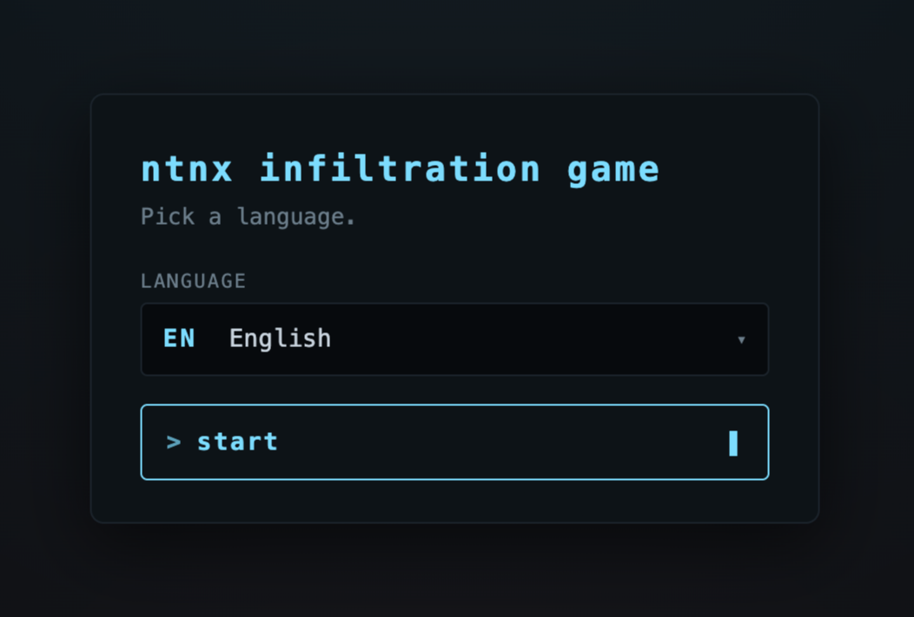
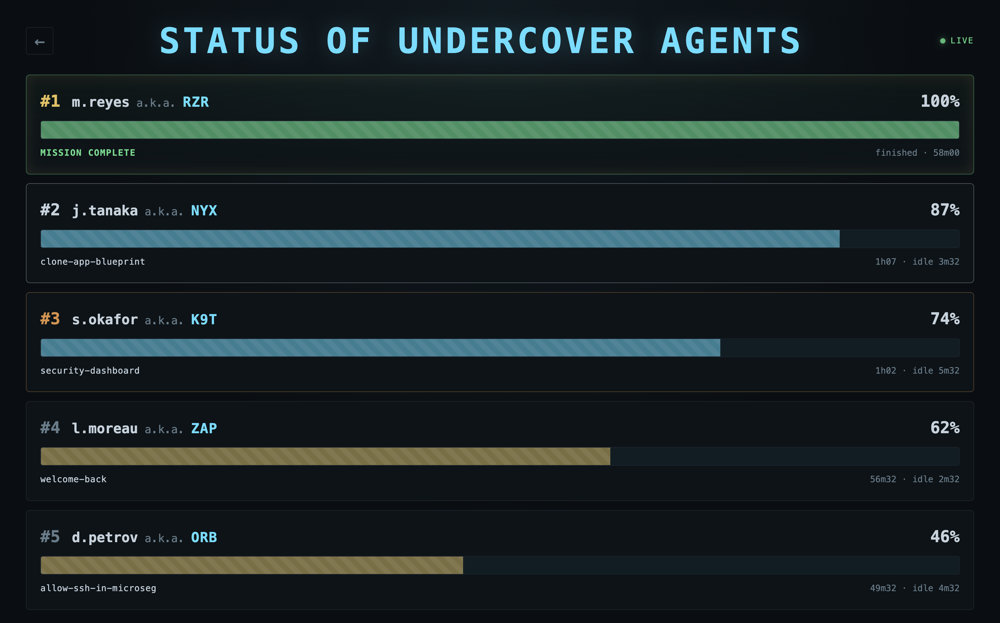

# ntnx-infiltration-game



A hands-on game that teaches the **Nutanix Cloud Platform** by playing it. Players work through a covert "infiltration" mission of real lab tasks (create a user, a project and a network, deploy a VM, set security and protection policies, expand the cluster) and every step is checked live against a real Prism Central. Put the scoreboard on a screen and let a room learn NCP by doing.



39 stages, 25 live checks against the Nutanix v4 APIs, three languages, an operator console, and a live leaderboard. Deploys on any PC 7.5 from a [Calm blueprint](./tooling/blueprint/).

Based on the original [`ntnx-escape-game`](https://github.com/Golgautier/ntnx-escape-game) by Golgautier.

## Quickstart

You need an HPoC and two files. That's it.

1. Book an HPoC with the **AOS + PC Demo - Latest (7.5.x)** runbook.
2. Download the two assets from the [latest release](https://github.com/r0w/ntnx-infiltration-game/releases/latest): `nig-00-runbook-prerequisites.json` and `nig-01-blueprint.json`.
3. **Run the runbook** (Self-Service > Runbooks): upload `nig-00...` and run it. It creates the AD endpoint the install needs.
4. **Launch the blueprint** (Self-Service > Blueprints): upload `nig-01...`, set the `NUTANIX` credential to your PC admin password, then launch and fill the short form (PC IP + credentials, run mode). The install then runs on its own.
5. When the app reaches `running`, its description shows the URLs: `/` for players, `/scoreboard` for the projector, `/admin` for you.

Want to tune it (pick the run mode, gate stages, lock for lunch, wire a multi-cluster leaderboard, email your participants)? It's all in the [**operator guide**](docs/OPERATOR.md).

## Develop locally

Two terminals. Bun auto-loads `.env`.

```bash
bun install
cp .env.example .env

# terminal 1 - backend on :3000
bun run dev

# terminal 2 - frontend on :5173 with /api proxied
bun run dev:frontend
```

Open <http://localhost:5173>. Default mode is `mock` - fixtures back the entire scenario, all 39 stages playable end-to-end without a Prism Central.

## Stack

| Layer | Choice |
|---|---|
| Runtime | Bun 1.3 (built-in SQLite, TypeScript, bundler, test runner) |
| HTTP | Hono |
| Persistence | `bun:sqlite` |
| Frontend | Vite + React with a custom HTML faux-terminal - no xterm, no SSH |
| Content | JSON stages + JSON locale catalogs + TS check functions in `packs/<GAME_PACK>/` |
| Blueprint | Calm DSL (Python) in `tooling/blueprint/` |

## Modes

`MODE` env var picks one of three runtime profiles. **Mock is the default and needs no Prism Central.**

| Mode | Cluster | Dev tools | Use when |
|---|---|---|---|
| `mock` | none - fixtures | shown | Local dev, CI, demo without a cluster |
| `test` | real PC | shown | Iterating against a live HPoC (auto-play fires acts for you) |
| `live` | real PC | hidden | Production demo / event |

For `test` / `live`, set `PC_ENDPOINT` / `PC_USER` / `PC_PASSWORD` in `.env`. See `.env.example` for the full list.

## Repo layout

```
packages/
  engine/       state machine, parser, gating, locale resolution - zero I/O, fully unit-tested
  server/       Hono + bun:sqlite, session service, routes, pack loader
  nutanix/      NutanixClient facade - mock + live (REST + SDK-per-domain) + capability probe
  frontend/     Vite + React faux terminal
  shared/       wire types
packs/
  ntnx-infiltration/   39 stages, locales/ (en, fr, de, + es/it as WIP), checks, fixtures, scripts/
tooling/
  blueprint/    Calm DSL Python blueprint + post-compile patcher
docs/
  OPERATOR.md       host-it-at-an-event guide (quickstart + detailed operator)
  ARCHITECTURE.md   boundaries diagram, design rationale
  STAGES.md         stage map (39 stages, name, check function, parity with original Python)
  TESTS.md          what's tested and how
  screenshots/      illustrative captures (mock demo data)
```

## Authoring a stage

1. Add a JSON file in `packs/<pack>/stages/`, e.g. `my-stage.json`:
   ```json
   {
     "id": "my-stage",
     "name": "my-stage",
     "active": true,
     "messages": ["my-stage.ask", "my-stage.confirm"],
     "check": { "fn": "checkVMExists", "args": { "name": "demo-vm" } },
     "captures": ["VMUUID"]
   }
   ```
2. Add the keys to each `packs/<pack>/locales/<code>.json`. Missing keys fall back to the default locale, then to the key itself (a grep-able translator marker).
3. Add the stage name to `pack.json.stages[]` at the position you want it played.
4. Export the check function from `packs/<pack>/checks/index.ts`.
5. (For mock mode) Add a fixture to `packs/<pack>/fixtures.json` keyed by `"METHOD path"`.
6. Tag with `"impact": "destructive"` if the stage mutates cluster-wide state - it then only runs when the cluster profile is `hpoc`. Tag `"requires": ["NCM"]` (or `IO`, `CalmDSL`, `NodeRemove`) if the stage depends on an optional feature.

The frontend `DevPanel` lets you jump to any stage without replaying the whole game. Captured variables and the cluster cache are preserved across jumps. Restart the backend after editing pack JSON - Bun caches the pack at boot.

## Adding a language

Drop `packs/<pack>/locales/<code>.json` with every key from `en.json` translated, add `"<code>"` to `supportedLocales` in `pack.json`, restart. No code change.

## Development

```bash
bun test           # full suite across engine + server + nutanix + frontend
bun run typecheck  # tsc --noEmit, all 4 workspace packages
```

CI runs both on every push and PR. No live cluster needed - everything is mock-backed.

## Contributing

The repo is a single Bun monorepo (`packages/*` + `packs/*`). No external service needed for dev.

- TypeScript everywhere except the blueprint (Python, Calm DSL).
- Two-space indents, single quotes, trailing commas, no semicolons except where TS requires them. Match the surrounding style.
- Tests close to the code they cover (`packages/<pkg>/test/<name>.test.ts`).
- Touching the install runbook or blueprint? See [`tooling/blueprint/README.md`](./tooling/blueprint/README.md).

Issues and pull requests welcome.
