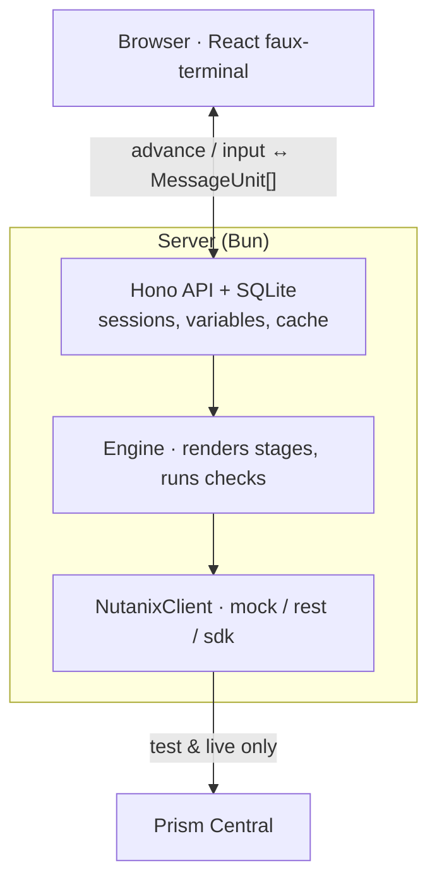

# Architecture at a glance

A Hono server (Bun + SQLite) loads a content pack at boot and runs a game-agnostic engine that renders stages into pre-parsed `MessageUnit[]`. A React faux-terminal streams those units char-by-char. Every Nutanix call goes through one `NutanixClient` interface with `mock` / `rest` / `sdk` adapters.



Read it top to bottom: the browser talks JSON to the Hono API, which runs the engine; the engine renders each stage into `MessageUnit[]` for the browser and runs its checks through the `NutanixClient`. Only `test` and `live` modes reach a real Prism Central; `mock` answers from fixtures.

## Skip and resume without replay

The original Python game re-validated every earlier stage against the live cluster on each advance. Because checks populated UUIDs as a side effect, skipping was impossible: jump to stage 20 and stages 1-19's checks hadn't run, so the UUIDs were missing.

Here the state lives in SQLite, so nothing replays:

- `stage_history` records `passed | skipped | failed | disabled` per (session, stage).
- `session_variables` holds captured inputs (Trigram, Username, …).
- `cluster_cache` holds Nutanix UUIDs keyed by `(entity_kind, logical_name)`.

The runner picks the next stage that is active, whose required capabilities are present, whose impact is allowed on the cluster profile, and that sits after the current one. `skipTo(stage)` walks the skipped stages and calls `rehydrate()` (a light UUID lookup, not the interactive check) so the cache and variables are filled without prompting the player.

## Two-axis stage gating

| Axis | Source | Effect |
|---|---|---|
| Capabilities | `capability-probe.ts` at session start | A stage's `requires: ['NCM','IO',…]` auto-disables it if the cluster lacks them |
| Impact | `CLUSTER_PROFILE` (`hpoc` \| `other`) | `"impact":"destructive"` stages run only on `hpoc` |

Both write `status='disabled'` into `stage_history`, so an operator can see why a stage was skipped.

## Content is data, engine is code

A pack is a directory the engine never imports; the server loads it by path at boot (`GAME_PACK=...`):

```
packs/ntnx-infiltration/
├── pack.json          # manifest: defaultLocale, supportedLocales, stage order
├── stages/<name>.json # one file per stage; messages are locale keys, not prose
├── checks/index.ts    # name → CheckFunction
├── locales/en.json    # flat { key: template }; add a language = add a file
└── fixtures.json      # mock-mode responses
```

A stage carries ordered catalog keys. The runner resolves each against the requested locale, falling back to `defaultLocale` and then to the key itself, so a missing translation shows up in-game as the raw key (a grep-able marker). Adding a language is pure data; a second game on another product is a new `packs/` directory and a different `GAME_PACK`.

`packs/nkp-bootcamp` is that second game, and it exercised the claim. Content was
indeed pure data, but two things were not: its checks read Kubernetes rather than
Prism (see the transport below), and a pack that teaches through screenshots
wants different presentation from one that does not. So the manifest also carries
display and boot switches, all defaulting to the infiltration game's behaviour:

| Key | Effect when true |
|---|---|
| `pauseAfterImages` | Park on a "press Enter" after each image so it is not scrolled away |
| `imageCaptions` | Print each image's alt text under it, not just in the lightbox |
| `title` | The name players see, so a second pack is not branded as the first |
| `clusterFacts` (false) | Skip the two Prism boot probes a pack that reads no cluster facts does not need |
| `nav` | A contents menu down the side of the terminal, in the source material's chapters |
| `speakers` | Who fills a stage's `prompt` role, e.g. `{"tank": "instructor"}` |
| `identity` | Which captured variable names a player, and what `/admin` calls it |

### The contents menu

The infiltration game is a story played forward and has no menu. A bootcamp is a
course someone came to learn from, and a learner re-reads: `nav` in the manifest
gives that pack a table of contents, chapters and one level of nesting, with
locale keys for the labels so the menu translates like everything else.

Two rules keep it honest. **It never advances the game**: a row opens a panel
that re-renders that stage's text, and the run behind it does not move, so a
menu can never skip a lab. And **it never reads ahead**: `readStage` refuses
anything past the player's own position, or the menu would be an answer key for
every lab still to come. The prompts, pauses and check beats are stripped on the
way out — what comes back is the material, not a replayable turn.

Re-rendering server-side rather than scrolling the transcript is what lets a
learner in Observability go back to Persistent storage: the scrollback only
holds what this browser tab has played, and a reload empties it. A stage's run
position is read from `pack.stages`, not restated in `nav`; the pack test locks
the two orders together (`packages/server/test/nkp-pack.test.ts`).

The panel stacks under the lightbox, so a screenshot opened from it still
enlarges over the top. Escape then peels one layer at a time: the lightbox
publishes `isOpen` and the panel below stands down while it is up.

### Who the operator sees, and what a stage needs

Two things the infiltration game could hardcode and a second pack could not.

**Identity.** `/admin` used to read `Trigram` directly, so a pack that asks for
a user number listed every session as nameless — and the Users tab hides
nameless sessions by default, so the bootcamp's learners were invisible and
could not be cleaned up from the UI. `identity` in the manifest names the
variable and its label; the field on the wire is still called `trigram`,
because renaming it would ripple through the scoreboard and the session table
for no gain.

**Prerequisites.** `needs` models data moving between stages, and the Pack tab
cascades a disable through it. A bootcamp lab does not consume a *variable*
from the stage before it, it consumes the *namespace* that stage created, so a
disabled create-project left the storage labs looking fine and failing on the
cluster. `dependsOn` names the stage instead, and the same fixed-point cascade
covers it. A prerequisite the pack does not ship is ignored, not fatal: a typo
in a manifest should not disable a working stage.

One asymmetry worth knowing: a check's `hint` is written for the player and
`detail` for the operator and the logs, and `/admin` reads only `detail`. The
infiltration game keeps them different on purpose, since the hint must not
spoil a puzzle. A bootcamp has nothing to spoil, so its checks lend the hint
out as the detail rather than leaving the operator with an empty chip.

### Saying more than the source

The published bootcamp writes `<ingress_lb_ip>` and tells the reader to look
the value up, because one document serves every lab. A running game holds a
kubeconfig, so at boot it reads the management and workload ingress addresses
and seeds them as variables the pack's text interpolates — the learner reads
their own hostname. When an address cannot be read, the variable falls back to
the bootcamp's own placeholder, so the step degrades to the published wording
instead of rendering a hole into the middle of a hostname.

### Acts write, checks read

A check's transport is read-only by contract; an act's is not. `KubeClient`
carries `apply` (server-side apply, hence idempotent), `patch` (merge) and
`remove`, and only `ActContext.kube` hands them out — a check that mutated the
cluster it judges would be marking its own homework. The mock store is mutable
too, so a fixture-backed run can go act → check without a cluster.

Two constraints shape the NKP acts. Kommander's Continuous Deployment tab is
**not reproducible over the API**: it writes the project's config into
Kommander's own management git repository, and KubeFed federates only core
types, so a Kustomization created on the management cluster deploys there. The
acts write the Flux objects on each cluster the app must reach instead — a
different path to the same end state, which is what the checks assert. And
`serviceAccountName` must equal the namespace name, because Kommander creates
one SA per project namespace under that name and its Gatekeeper policy
(`kustomization-must-have-sa`) defaults to it.

The operator endpoints (`/api/act/…`) take either identity: the path segment
seeds `Trigram` and, when it looks like `user01` / `01`, `UserNum`. Bulk
`auto-play` chains every act into one request, so no act may wait anywhere near
Bun's 255 s ceiling; the checks fail *neutral* on "still starting" and the run
simply asks again.

## Two transports, one shape

A check's only handle on the world is its context. `ctx.nutanix` reaches Prism
Central; `ctx.kube` reaches Kubernetes and is present only for packs that need
it. Both follow the same contract: an interface the engine names, a mock adapter
backed by the pack's `fixtures.json`, and a live adapter. That is what lets the
whole NKP run play with no cluster at all.

`packages/kube-transport` differs from the Nutanix one in a way worth knowing:
an NKP fleet is several clusters, so a client is a router. `ref.cluster` picks
one by NKP name and omitting it means the management cluster — necessary because
a Project is a management object while the namespace it federates lives on a
workload cluster. The operator still supplies one kubeconfig: the workload
credentials are read from the CAPI `<cluster>-kubeconfig` secrets at boot.

## Wire protocol

The frontend never parses markup. The server parses a small JSX-like grammar (`{Name}`, `<pause sec='3'/>`, `<input var='X'/>`, `<action name='foo'/>`, `<clear/>`, `<code>`, `<image>`, `<demo>`, style tags) into `MessageUnit[]`:

```ts
type MessageUnit =
  | { kind: 'text'; text: string; color?: string; styles?: string[]; href?: string }
  | { kind: 'pause'; ms: number }
  | { kind: 'await-input'; variable: string }
  | { kind: 'clear' }
  | { kind: 'page-break' }
  | { kind: 'code'; text: string; lang?: string }
  | { kind: 'image'; src: string; alt?: string };
```

`POST /session/:id/advance` returns `{ units, ..., kind }` where `kind` is one of `units | awaiting-input | finished | gated | switch-session`. The input flow:

1. Client advances. The server renders the stage, stops at the first `await-input`, and records the render offset.
2. Client types the units, shows the input field at `await-input`, then POSTs `/input {variable, value}`.
3. The server persists the variable and re-renders from the offset. A stage with a check streams a "wait…" line and defers the check; the client then POSTs `/resolve-check`, which runs it and returns the verdict.

Between messages the engine injects a `\n` text unit so JSON lines map one-to-one to terminal lines under `white-space: pre-wrap`.

## Frontend playback

Units play one at a time, not in parallel. `FauxTerminal` tracks an `activeIdx`: the unit at `activeIdx` is playing, later ones are hidden. `TypewriterText` types at `typingSpeedMs` then advances the index; pauses set a timer; instant units (info, check-result) advance immediately. Completed text is kept in state so it stays on screen as the sequencer moves on.

## Session lifecycle

Creation is anonymous: `POST /api/session { locale? }` returns a `sessionId` kept in `localStorage`. Trigram, PIN and username are captured in-game as normal variables.

On reload, `GET /api/session/:id` returns a `replay: MessageUnit[]` re-rendered up to the awaiting input (from the current variables + cache). The frontend prepends a `[resumed at …]` line and streams the replay, then the input field appears. A `409` on advance re-hydrates the client; a `404` (DB reset) drops the stale session back to the login screen.

## Dev iteration

`GET /api/pack` lists every stage; `POST /api/session/:id/goto/:stage` jumps forward or backward, clearing `stage_history` from the target while preserving variables + cache. The frontend `DevPanel` turns both into a clickable stage grid, colour-coded by impact and capability.
