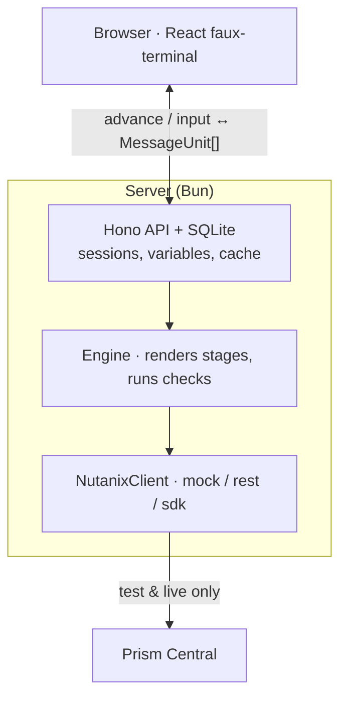

# Architecture at a glance

A Hono server (Bun + SQLite) loads a content pack at boot and runs a game-agnostic engine that renders stages into pre-parsed `MessageUnit[]`. A React faux-terminal streams those units char-by-char. Every Nutanix call goes through one `NutanixClient` interface with `mock` / `rest` / `sdk` adapters.


```mermaid
flowchart TB
  FE["Browser · React faux-terminal"]
  subgraph SRV["Server (Bun)"]
    direction TB
    API["Hono API + SQLite<br/>sessions, variables, cache"]
    ENG["Engine · renders stages, runs checks"]
    NC["NutanixClient · mock / rest / sdk"]
    API --> ENG --> NC
  end
  PC["Prism Central"]
  FE <-->|"advance / input ↔ MessageUnit[]"| API
  NC -->|"test & live only"| PC
```

Read it top to bottom: the browser talks JSON to the Hono API, which runs the engine; the engine renders each stage into `MessageUnit[]` for the browser and runs its checks through the `NutanixClient`. Only `test` and `live` modes reach a real Prism Central; `mock` answers from fixtures.

## Skip and resume without replay

The original Python game re-validated every earlier stage against the live cluster on each advance. Because checks populated UUIDs as a side effect, skipping was impossible: jump to stage 20 and stages 1-19's checks hadn't run, so the UUIDs were missing.

Here the state lives in SQLite, so nothing replays:

- `stage_history` records `passed | skipped | failed | disabled` per (session, stage).
- `session_variables` holds captured inputs (Trigram, Username, …).
- `cluster_cache` holds Nutanix UUIDs keyed by `(entity_kind, logical_name)`.

The runner picks the next stage that is active, whose required capabilities are present, whose impact is allowed on the cluster profile, and that sits after the current one. `skipTo(stage)` walks the skipped stages and calls `rehydrate()` (a light UUID lookup, not the interactive check) so the cache and variables are filled without prompting the player.

## Two-axis stage gating

| Axis | Source | Effect |
|---|---|---|
| Capabilities | `capability-probe.ts` at session start | A stage's `requires: ['NCM','IO',…]` auto-disables it if the cluster lacks them |
| Impact | `CLUSTER_PROFILE` (`hpoc` \| `other`) | `"impact":"destructive"` stages run only on `hpoc` |

Both write `status='disabled'` into `stage_history`, so an operator can see why a stage was skipped.

## Content is data, engine is code

A pack is a directory the engine never imports; the server loads it by path at boot (`GAME_PACK=...`):

```
packs/ntnx-infiltration/
├── pack.json          # manifest: defaultLocale, supportedLocales, stage order
├── stages/<name>.json # one file per stage; messages are locale keys, not prose
├── checks/index.ts    # name → CheckFunction
├── locales/en.json    # flat { key: template }; add a language = add a file
└── fixtures.json      # mock-mode responses
```

A stage carries ordered catalog keys. The runner resolves each against the requested locale, falling back to `defaultLocale` and then to the key itself, so a missing translation shows up in-game as the raw key (a grep-able marker). Adding a language is pure data; a second game on another product is a new `packs/` directory and a different `GAME_PACK`. No engine changes either way.

## Wire protocol

The frontend never parses markup. The server parses a small JSX-like grammar (`{Name}`, `<pause sec='3'/>`, `<input var='X'/>`, `<action name='foo'/>`, `<clear/>`, `<code>`, ``, style tags) into `MessageUnit[]`:

```ts
type MessageUnit =
  | { kind: 'text'; text: string; color?: string; styles?: string[]; href?: string }
  | { kind: 'pause'; ms: number }
  | { kind: 'await-input'; variable: string }
  | { kind: 'clear' }
  | { kind: 'page-break' }
  | { kind: 'code'; text: string; lang?: string }
  | { kind: 'image'; src: string; alt?: string };
```

`POST /session/:id/advance` returns `{ units, ..., kind }` where `kind` is one of `units | awaiting-input | finished | gated | switch-session`. The input flow:

1. Client advances. The server renders the stage, stops at the first `await-input`, and records the render offset.
2. Client types the units, shows the input field at `await-input`, then POSTs `/input {variable, value}`.
3. The server persists the variable and re-renders from the offset. A stage with a check streams a "wait…" line and defers the check; the client then POSTs `/resolve-check`, which runs it and returns the verdict.

Between messages the engine injects a `\n` text unit so JSON lines map one-to-one to terminal lines under `white-space: pre-wrap`.

## Frontend playback

Units play one at a time, not in parallel. `FauxTerminal` tracks an `activeIdx`: the unit at `activeIdx` is playing, later ones are hidden. `TypewriterText` types at `typingSpeedMs` then advances the index; pauses set a timer; instant units (info, check-result) advance immediately. Completed text is kept in state so it stays on screen as the sequencer moves on.

## Session lifecycle

Creation is anonymous: `POST /api/session { locale? }` returns a `sessionId` kept in `localStorage`. Trigram, PIN and username are captured in-game as normal variables.

On reload, `GET /api/session/:id` returns a `replay: MessageUnit[]` re-rendered up to the awaiting input (from the current variables + cache). The frontend prepends a `[resumed at …]` line and streams the replay, then the input field appears. A `409` on advance re-hydrates the client; a `404` (DB reset) drops the stale session back to the login screen.

## Step-by-step help

A stage can ship an optional help block (`help`: locale keys, `helpPenaltySec`: seconds), shown only when the player asks. `POST /api/session/:id/help` renders it through the same pipeline as the stage text (`StageRunner.renderHelp`: locale fallback, `{Var}` substitution, flow tags dropped) and returns plain `MessageUnit[]`; the frontend wraps them in a framed, foldable block with zoomable screenshots. The call never touches the awaiting / pending-check state.

- **On/off**: the global flag lives in `cluster_config.help_enabled` (off by default, toggled in `/admin`); `sessions.help_enabled` is a per-session override (`NULL` follows the global flag, `1` / `0` force it). The player-level value wins in both directions, and the server enforces it, so the UI only mirrors it. The client learns the effective flag from the session snapshot, which the heartbeat polls every 5 s.
- **Cost**: the first display of a stage records a `help_usage` row whose `penalty_sec` is frozen at that moment; showing it again is free. A first display that costs time answers `confirm-required` until the client re-posts with `confirm: true` and the amount it showed (`penaltySec`); a confirmation naming another amount than the current cost is refused with a new `confirm-required`, so a cost the operator changed in between is never billed unseen.
- **Cost override**: the operator can change a stage's cost from the Pack tab (`PUT /api/admin/pack/stages/:name/help-penalty`). It is stored in `pack_overlay.help_penalty_sec` (`NULL` = the pack's `helpPenaltySec`, and a value equal to the pack default is stored as `NULL`), applied on top of the stage by `applyOverlay` like the active / gate overrides, range 0-3600 s. It is part of the portable `NIG1.` config and counts as drift. `/api/pack` and `/api/admin/pack` expose the effective cost; `help_usage.penalty_sec` is never rewritten.
- **Ranking**: the penalties are added to the playing time, see [Playing time and ranking](#playing-time-and-ranking).

## Playing time and ranking

Finished players are ranked on their **playing time**: `finished_at - started_at`, minus the time the operator held them, plus the sum of their help penalties (in ms). Comparing absolute finish times would punish a late starter and ignore that two players reached a gate at different moments.

- **Waits**: `session_waits` records each period a session was held by an admin gate (`reason = 'gate'`, with the gated stage) or by the pack-wide pause (`'pause'`). `advance()` opens one at the first `gated` answer; the operator's unlock (`setGateUnlock`), resume (`setGlobalPause(false)`) or a stage-config change (`applyEffectiveStages`) closes it at that instant, through `releaseWaits()`, so a player who closed the tab is not credited. A partial unique index allows one open wait per session: a player held by a gate and then a pause has a single wait, which ends when neither holds them, and the durations simply add up. A session that gets past the gates while a wait is still open closes it (safety net, also before the finish).
- **Order** (`listScoreboard`): finished first, more stages passed, shortest playing time, earliest finish, most recent activity, earliest start. Players still playing have no playing time yet and are ordered as before.
- **Combined board**: `mergeScoreboards` sorts on stages passed, `effectiveDuration` (the same time), earliest finish, earliest start. Entries also carry `blockedMs` (waits that are over), `blockedSince` and `blockedReason` (the running wait) and `lastReleasedAt`; a peer on an older version sends none of them and its waits count as 0, as its penalties do.
- **Cards**: the card clock (`scoreboardTime.ts`) runs to `blockedSince`, `finishedAt` or now, minus the start and `blockedMs`, plus `helpPenaltySec` (so it is the time finished players are ranked on), and a held player's clock stops; the idle hint counts from the later of `lastActivityAt` and `lastReleasedAt`, and gives way to a `paused` (gate) or `lunch` (pause) chip while the player is held. The help badge sits to the left of the clock on its line, and the chips on the stage line.
- **Limits**: only waits recorded since the version was deployed are known, so roll it out before an event. Time lost to a problem inside the game is not a wait.

## Dev iteration

`GET /api/pack` lists every stage; `POST /api/session/:id/goto/:stage` jumps forward or backward, clearing `stage_history` from the target while preserving variables + cache. The frontend `DevPanel` turns both into a clickable stage grid, colour-coded by impact and capability.
