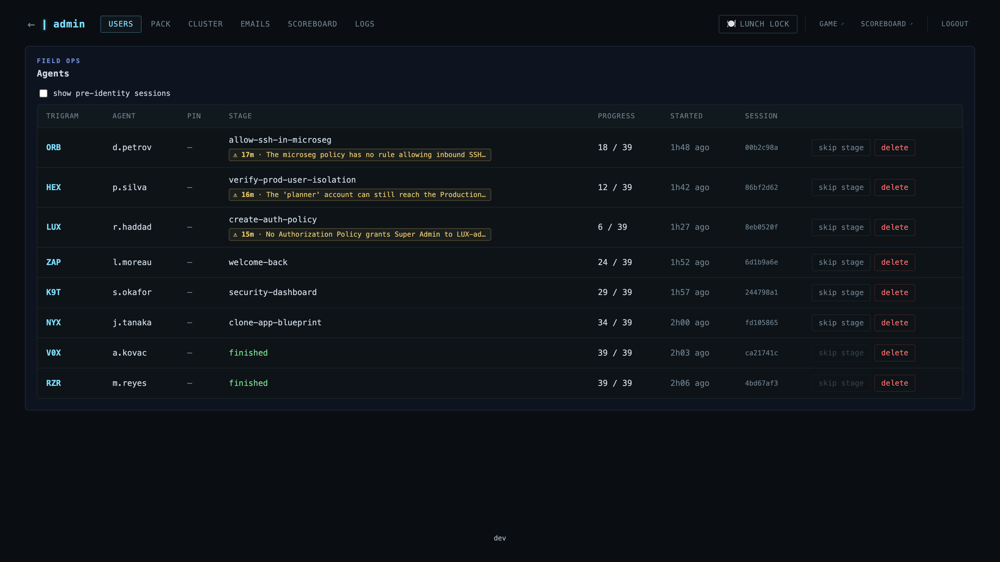
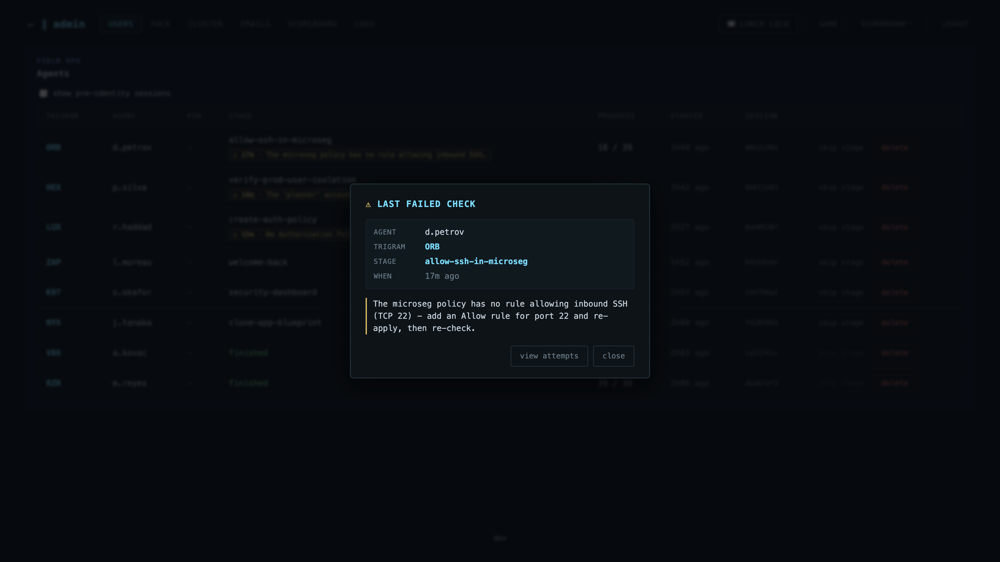

# Operator guide

Everything you need to host the **Nutanix Infiltration Game** at an event, a demo, or a training session.

To develop the game itself, see [`../README.md`](../README.md). For the blueprint internals, see [`../tooling/blueprint/README.md`](../tooling/blueprint/README.md).

## Quickstart

You need an HPoC and two files. About five minutes of clicks, then the install runs on its own.

1. **Book an HPoC** with the **AOS + PC Demo - Latest (7.5.x)** runbook (4 nodes, Flow and Leap enabled). On a fresh HPoC, enable **Intelligent Operations** once in Prism (Settings > Intelligent Operations); one stage needs it.
2. **Download the two assets** from the [latest release](https://github.com/r0w/ntnx-infiltration-game/releases/latest): `nig-00-runbook-prerequisites.json` and `nig-01-blueprint.json`.
3. **Run the runbook** (Self-Service > Runbooks): upload `nig-00...` and run it. It creates the AD endpoint the install needs. Leave **Target project** on `lab` unless your HPoC has no project by that name (check Prism > Projects).
4. **Launch the blueprint** (Self-Service > Blueprints): upload `nig-01...`, set the `NUTANIX` credential to your PC admin password, then launch and fill the [short form](#the-launch-form). The install then runs on its own (30-40 min).
5. When the app reaches **`running`**, its description shows the URLs.

Then share three links:

- **Players:** `http://<vm>:3000/`
- **Scoreboard:** `http://<vm>:3000/scoreboard` (put it on a screen)
- **You:** `http://<vm>:3000/admin` (the console below)

Players also need the Prism Central URL and credentials you deployed with, and a browser with internet access.

## The operator console

Everything runs from `http://<vm>:3000/admin`. Default password **`nutanix/4u`**; change it with **`ADMIN_PASSWORD`**. It's a light guard for a trusted room, not real security.

- **Agents** (Users tab): the live roster. Anyone failing a check floats to the top with a chip saying exactly what's wrong, so you can help. Per player: **skip stage** and **delete**.

  

  

- **Gates**: hold the whole room at a chosen stage until you press **unlock**. Pick which stages gate on the Pack tab.
- **Lunch lock**: one header button parks everyone on a "back soon" screen. **Resume** when you return.
- **Disable a stage** (Pack tab): flip a stage off and players skip it, live, no redeploy.
- **Multi-cluster scoreboard** (Scoreboard tab): add other instances' URLs to merge everyone into one leaderboard.
- **Emails** (Emails tab): send invitations and lab summaries via Mailtrap, once per participant.

## Detailed operator

### Cluster prerequisites

Booking with the **AOS + PC Demo - Latest (7.5.x)** runbook gives the tested versions (AOS 7.5, PC 7.5, Self-Service 4.3.1, Flow Networking + Security, Leap). Two things to know:

- **4 nodes**, no more, no less. The install removes one so stage 28 (expand-cluster) has a node to add back.
- **Intelligent Operations enabled.** The create-report stage checks against it. Fresh HPoCs ship it off; enable it in Prism. `/admin` shows a banner while it's off.
- **A cluster dedicated to the game.** The install reshapes it: removes a node, creates the production VMs, project and subnets.

### The launch form

Click **Credentials** and set the `NUTANIX` credential to your PC admin password, then fill the runtime form:

| Field | Value |
|---|---|
| Cluster profile | `hpoc` (the default - a dedicated HPoC) |
| Run mode | `live` for an event, `test` for dry-runs |
| Time zone | the event's local zone |
| Prism Central IP | your PC IP, no scheme or port (e.g. `192.0.2.10`) |
| Prism Central username | `admin` |
| Prism Central password | the PC admin password |
| Planner PC password | leave the pre-filled default (ask the game team if empty) |
| ghcr.io token | leave empty (only for a private image repo) |
| Image tag | `latest` (or a specific `vX.Y.Z`) |
| Container image repository | leave default |

The substrate section asks for the cluster and first NIC subnet (any real ones on your HPoC). Submit.

### Run modes

- **`live`** - the event mode: real cluster, dev tools hidden from players.
- **`test`** - same, but dev tools shown and auto-play can fire the acts for you. Good for a dry run.
- **`mock`** - no cluster, fixtures back every stage. The local dev mode; you won't deploy in it.

## Day-2 actions

The blueprint exposes two actions in Self-Service > Apps:

- **UpdateGame** pulls a newer game container image (set `IMAGE_TAG=vX.Y.Z` to pin, or `latest`) and restarts it. Sessions persist.
- **VerifyState** re-runs the install's final check to confirm the cluster is still in the expected shape.

## Reference

- Cluster pre-reqs from the original [`Golgautier/ntnx-escape-game`](https://github.com/Golgautier/ntnx-escape-game) apply as-is; the blueprint mirrors that runbook.
- Blueprint internals: [`../tooling/blueprint/README.md`](../tooling/blueprint/README.md).
- Stage list: [`STAGES.md`](./STAGES.md).
